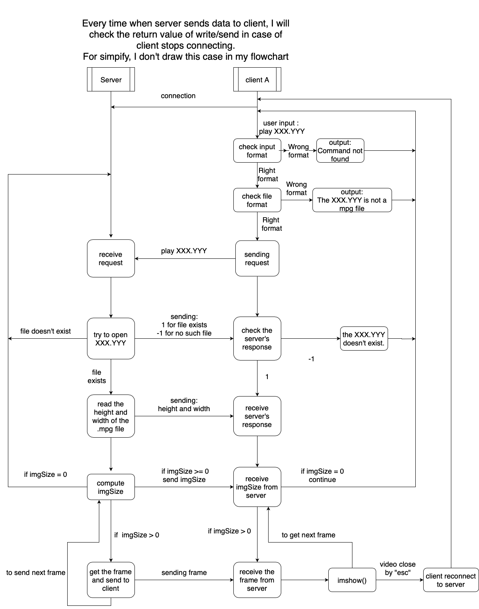
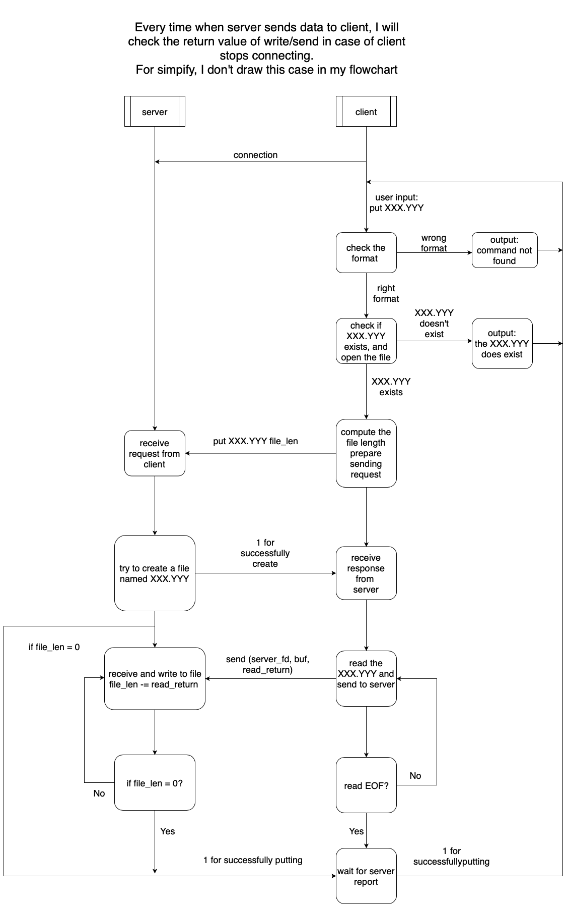
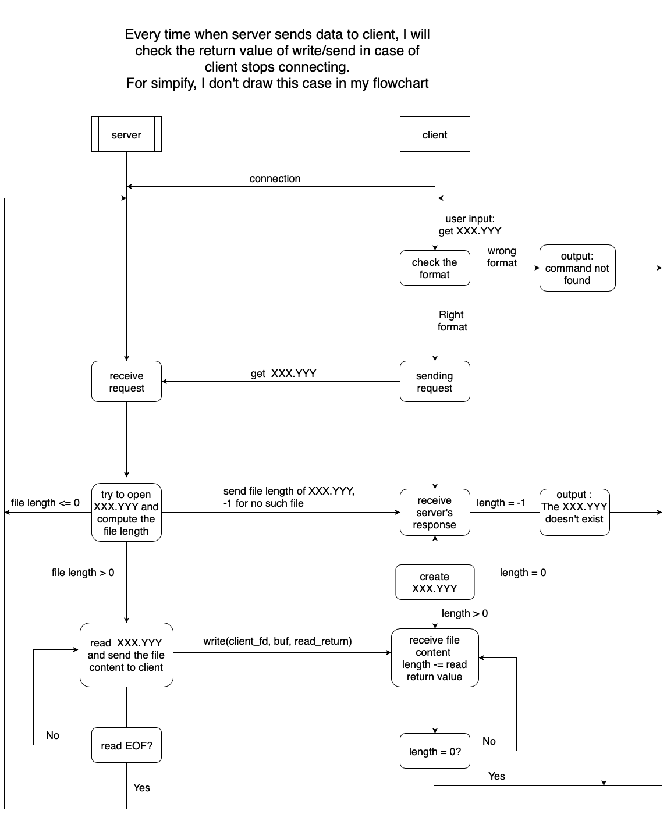

## CN HW2 Report

B06902048 資工三 李峻宇

Environment : Ubuntu 16.04, openCV 3.3.1, g++5.4.0

Something to note : when you `make clean`, My Makefile will remove `server`, `client` and folder of server and client.

####-Draw a flowchart of the video streaming and explains how it works in detail. 

1. Client successfully connects to server.
2. User input `play XXX.YYY`, My program will first check the format, if it's wrong, it will output `Command not found` and back to wait input; if it's right format, then it will check the filename, to see whether the file is a  `.mpg` file. If not, it will ouput `The XXX.YYY is not a mpg file.` and back to wait input.
3. My program will then send request `play XXX.YYY` to server, and wait server's response. Once server receive client request, it will check if XXX.YYY exists, If yes, it will send `1` to client; if not, it will send `-1` to client, and then open the `XXX.YYY` to get information. Server then send height and width to client, and each time this client fd is selected, server will send image size and one frame to client.
4. Client receive server's response, if it is `-1`, ouput `the XXX.YYY doesn't exist.`; if it is `1`, client will wait to receive height and width. Then client will go into a `while` loop to receive frame.
5. Once client fd is selected by server program, server will get a new frame from `XXX.YYY`, computing the image size and sending to client. If the `XXX.YYY` ends, server will send a `0` image size to client and back to wait client request.  
6. In the `while` loop, client reveive a `int`, it will see it as image size, then it receives a frame and plays it immediately. If user sends `esc` to program, it will break the `while` loop and reconnect to server because the pipe might be nonempty. If the play ends, client will receive `0` image size and then break the `while` loop, back to wait user input.

####-Draw a flowchart of the file transferring and explains how it works in detail.
Put:

1. Client successfully connects to server.
2. User input `put XXX.YYY`, My program will first check the format, if it's wrong, it will output `Command not found` and back to wait input; if it's right format, then it will check if `XXX.YYY` exists ,If not, it will ouput `The XXX.YYY does exist.` and back to wait input.
3. Client then opens `XXX.YYY` and calculates the file length. It will then send request `put XXX.YYY file_length` to server, and wait server's response. Once server receive client request, it will try to create a new file named `XXX.YYY`, I assume it always succeeds, and server will send `1` to tell client file created successfully and therefore client can start to send file. Each time the client fd is selected, server will receive some file content.
4. Client receive `1` from client, then go into a `while` loop to read the file content and send to server. Once it read `EOF` from the file, it will break the `while` loop and back to wait user input.
5. when client fd is selected, server will receive file content from client, the write it to file. My server will calculate the remain file length. Once the remain file length is 0, server will close file fd and back to wait client's request. If client disconnect when transferring, server will delete the file.

get:

1. Client successfully connects to server.
2. User input `get XXX.YYY`, My program will first check the format, if it's wrong, it will output `Command not found` and back to wait input.
3. Client sends request `get XXX.YYY` to server, and wait server's response. Once server receive client request, it will try to open file named `XXX.YYY` to check if `XXX.YYY` exists. If it exists, server will calculate file length and send it to client; if not, server will send `-1` to client.
4. Client receive file length from client, if it's `-1`, client output `the XXX.YYY` doesn't exist and back to wait input. Otherwise it create a new file named `XXX.YYY` and go into a `while` loop to read the file content and from server. Client will calculate remain file length, once the remain file length is 0, client will close file fd and back to wait user input.
5. when client fd is selected, server will read file content from the file, the write it to client. Once it read `EOF` from the file, it will close the file and back to wait client request.

####-What is SIGPIPE? It is possible to happen to your code? If so, how do you handle it?

$SIGPIPE$ is the "broken pipe" signal, generated and sent to a program when this program is trying to write something to a pipe which isn't read by anyone or when it is attempting to write to a socket that is no longer open for reading. By default $SIGPIPE$ will terminate the program.

It is possible to happen in my program when server try to send something to client, such as **play** command and **get** command.  When client is terminated during receive server's message, $SIGPIPE$ will send to server.

I use a signal handler to avoid server being terminated by $SIGPIPE$. If server catch $SIGPIPE$, it will also have a write function return $-1$, then server knows there is a client disconnecting, and server can close this client's fd.

####-Is blocking I/O equal to synchronized I/O? Please give me some examples to explain it. 

It is not the same.

Blocking I/O means the I/O functions will block kernel until it finishes this I/O.

Synchronized I/O means the I/O functions will block user program until it finishes the I/O.

For example, I want to have lunch, but I'm lazy. I line to my friend to ask him to buy lunch for me. He will not line me until He finish buying my lunch, so he's "blocking". After I lined him, I keep looking my phone to see whether he finishes the job and I can't do any other thing, so I'm "synchronized".  