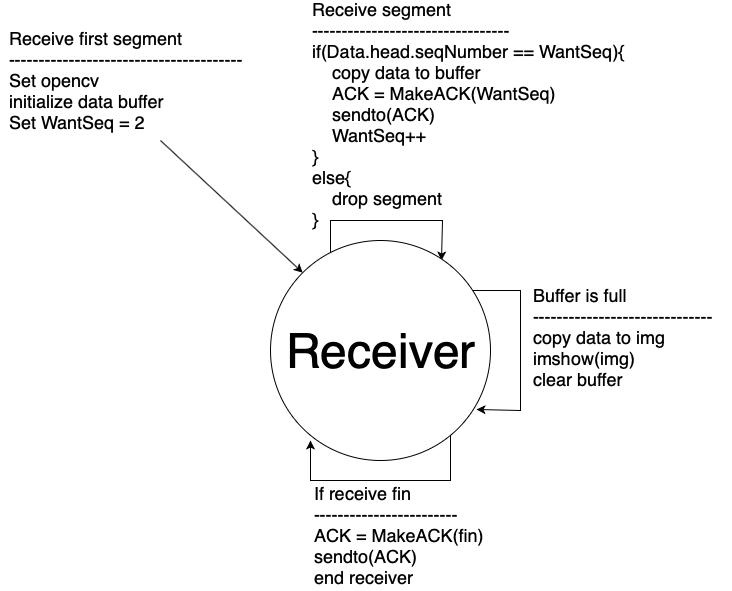
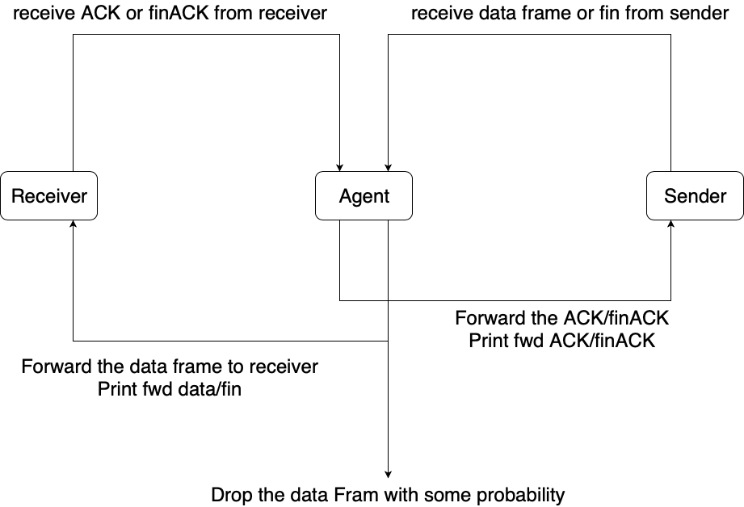
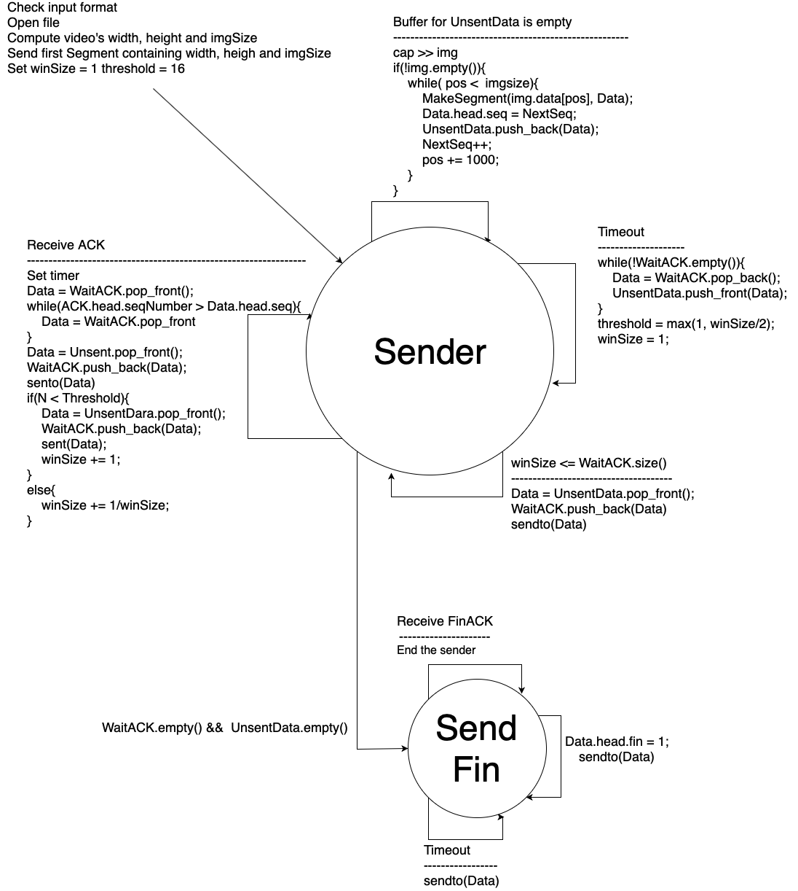
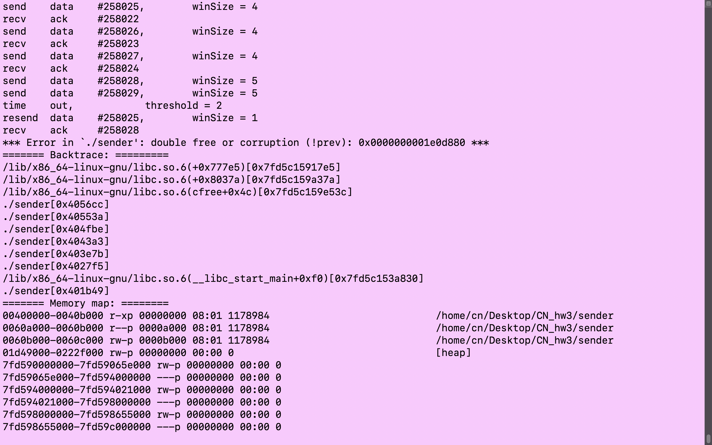

## CN HW3

*B06902048	資工三	李峻宇*

Environment : Ubuntu 16.04, openCV 3.3.1, g++5.4.0

Something to note : when you `make clean` , My Makefile will remove sender, receiver and agent.

####How to execute my program : 

Type `make` to compile `receiver.cpp`, `agent.c`, and `sender.cpp`

`./receiver <agent IP> <agent port> <receiver port>`

`./agent <sender IP> <receiver IP> <sender port> <agent port> <receiver port> <loss_rate>`

`./sender <agent IP> <agent port> <sender port> <filepath>`

#### Flowchart(FSM)

Receiver : 

Agent : 

Sender : 

#### Note

My receiver often ends with a `segmentation fault` in the main return 0, and I don't know why, but I sure it worked successfully.

Someone said that my receiver may somehow corrupt the stack in main so it's lost the return address. 

However, I think it's nothing about CN and the video was successfully played, so let it go~

And there might be some problem like this screenshot:

I think it is something wrong with function library, because I never use `malloc()` or `free()` in my Sender. If you encouter this, please execute it again, thanks!!